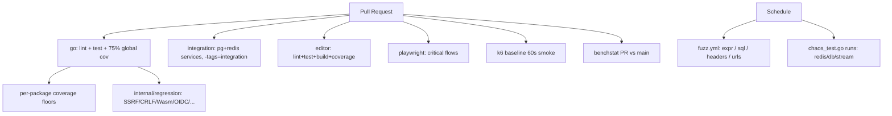

# Requirements

### Overview & Goals

Close the weaknesses identified in the Noda status review so the runtime is **trustworthy as production middleware**, not just "good for a 1.0". The goal is to harden:

- **Testing** — make CI catch the failure modes Noda promises to handle (real plugins, security regressions, fuzz, perf).
- **Correctness debt** — close the four still-open Critical/High findings (C4 DB transactions, H8 AND-join UX, H12 SQL surface, M11 cache generation).
- **Discoverability** — turn the DX gaps from `ISSUES.md` into runtime-visible behavior (error suggestions, schema-driven hints) plus targeted doc fixes, so "the runtime does what the docs say" stops requiring footnotes.

### Scope

**In scope**
- New CI jobs and matrices (integration, fuzz, perf, security regression).
- Per-package coverage floors and editor coverage gating.
- Improvements to the workflow test runner (`internal/testing/match.go`).
- Minimal runtime/plugin changes required to close C4, H12, M11, H8 (UX-only for H8) — but not full feature work beyond what the review demands.
- Targeted DX fixes (error message suggestions, expression diagnostics, docs cookbook).

**Out of scope**
- New product features.
- Rewriting the engine, plugin model, or editor.
- Anything requiring a 2.0 breaking-change cycle (e.g. renaming `cache`/`stream`/`pubsub` plugins).

### User Stories

- As an **operator**, I want CI to run against real Postgres/Redis so plugin bugs aren't hidden behind mocks.
- As a **plugin author**, I want fuzz targets on SQL/expression/header parsers so my changes can't silently regress security fixes.
- As a **workflow author**, I want test matchers (`$any`, `$regex`, `$skipFields`) and schema-validated mocks so my tests fail when the real plugin would.
- As a **release manager**, I want per-package coverage floors and a perf budget on PRs so a critical package can't decay below threshold.
- As a **new user**, I want unknown plugin names, `||` misuse, and `$env()` in workflows to produce errors that point me at the right thing.
- As a **security reviewer**, I want explicit regression tests for every confirmed Critical/High finding so a future refactor can't silently re-introduce SSRF, header injection, or Wasm lifecycle bugs.

### Functional Requirements

1. CI runs an **integration suite** against real Postgres + Redis for `plugins/db`, `plugins/cache`, `plugins/stream`, `plugins/pubsub` on every PR.
2. CI enforces **per-package coverage floors** for high-risk packages in addition to the existing 75 % global floor.
3. CI runs **fuzz targets** on a nightly schedule and surfaces crashers as artifacts.
4. CI runs a **k6 baseline smoke** with a small RPS budget on PRs and **benchstat-driven benchmark comparison** against `main`.
5. CI runs **explicit regression tests** for every confirmed Critical/High item: SSRF blocking, CRLF-stripped headers, Wasm `CallAsync` lifecycle, image-bomb guards, OIDC audience, storage path traversal, upload `storagePath`.
6. The workflow test runner supports `$any`, `$regex`, `$skipFields`, **and** validates mock outputs against the node's output schema.
7. **C4** — engine exposes a transaction handle that can be plumbed across `db.*` nodes (or explicit `db.tx.begin/commit/rollback` nodes), with tests covering commit, rollback, and nested errors.
8. **H12** — raw `db.query`/`db.exec` are opt-in (config flag) and have per-node timeouts; JOIN ON / WHERE / HAVING run through a stricter grammar with a documented allow-list.
9. **M11** — `internal/engine/cache.go` adds a generation token; stale workflow IDs across reloads return a typed error.
10. **H8** — AND-join collects all concurrent errors into a multierror; first-error semantics preserved for engine flow control, but the trace surfaces every failure.
11. **DX** — unknown plugin names, `$env()` used in workflow expressions, and `||` on non-bool operands produce errors that suggest the correct construct.

### Non-Functional Requirements

- CI total wall-clock should not increase by more than ~2× (parallelize integration job; keep fuzz nightly, not per-PR).
- No production runtime behavior change beyond what's required by the open findings.
- All new tests must pass under `-race` and respect the existing 10 m bench timeout.

# Technical Design

### Current Implementation

- **CI** (`.github/workflows/ci.yml`) has three jobs: `go` (lint + test + 75 % global coverage + govulncheck + build), `editor` (lint/test/build), `playwright` (E2E). No services. `benchmarks.yml` exists separately and is not gated on PRs.
- **Tests** — 171 `*_test.go` files. Plugins use mocks/in-process fakes. No `_integration` build tag.
- **Workflow test runner** — `internal/testing/match.go` uses `reflect.DeepEqual`. Mock outputs are not schema-validated.
- **Open findings** (from `REVIEW-FINDINGS.md`):
  - **C4** — `plugins/db/plugin.go:39-83` returns a `*gorm.DB` per service; no cross-node transaction.
  - **H12** — `plugins/db/where.go:43,119` builds JOIN ON via `fmt.Sprintf`; `plugins/db/query.go:49-78` and `exec.go:49-75` accept any resolved string.
  - **H8** — `internal/engine/executor.go:115-158` uses `firstErr.CompareAndSwap`; loser errors are discarded.
  - **M11** — `internal/engine/cache.go:54-76` has no generation/version token across reloads.
- **DX issues** (from `ISSUES.md`) — `cache`/`stream`/`pubsub` naming, three-mechanism env/var/secrets confusion, `||` vs `??`.

### Key Decisions

1. **Integration tests use GitHub Actions `services:` (not docker-compose).** Same image set as `docker-compose.yml`, but managed by the runner. Gated behind `//go:build integration` so local `go test ./...` stays fast.
2. **Per-package coverage floors live in CI as a small awk/script over `coverage.out`**, not in a separate tool. Initial floors: `internal/engine` 85 %, `internal/wasm` 80 %, `plugins/db` 80 %, `plugins/http` 80 %, `internal/plugin/resolve` 90 %.
3. **Fuzz is nightly, not per-PR.** Adds `fuzz.yml` workflow on `schedule:` + `workflow_dispatch:`. Per-target 5 m budget. Crashers uploaded as artifacts.
4. **Perf gating is two-tier.** A 60 s k6 baseline scenario gates PRs (catch order-of-magnitude regressions only). `benchmarks.yml` runs on `main` post-merge and posts a benchstat comment when triggered from a PR via label.
5. **C4 is solved with explicit `db.tx.begin/commit/rollback` nodes** (config-driven, matches Noda's model) backed by a transaction handle stored on the workflow execution context. Engine-driven implicit transactions are rejected — too magical for a config-driven runtime.
6. **H12 raw nodes become opt-in via service config** (`plugins.db.allow_raw_sql: true`), defaulting `false`. Existing configs with raw nodes log a deprecation warning until a minor release.
7. **H8 uses Go's `errors.Join`**, not a custom multierror dependency. First error is still returned for control flow; full set is attached to the trace event and exposed via `errors.Is`/`As`.
8. **DX error suggestions reuse the existing plugin registry and expr lexer** — no new dependency. Plugin name suggestions use Levenshtein on registered names; expression diagnostics post-process compile errors from `expr-lang`.

### Proposed Changes

#### CI
- Add `integration` job to `ci.yml` with `services: { postgres, redis }` and `go test -tags=integration ./...`.
- Add per-package floor check after `make test-coverage`.
- Add `make ci-loadtest-smoke` target — 60 s k6 run with hard error budget.
- Add `fuzz.yml` workflow (nightly + dispatch).
- Wire `benchmarks.yml` to compare PR head vs `main` via `benchstat` and post the diff.
- Editor: add Vitest coverage threshold + Playwright critical-flow allow-list in `editor/playwright.config.ts`.

#### Tests added
- `plugins/db/integration_test.go`, `plugins/cache/integration_test.go`, `plugins/stream/integration_test.go`, `plugins/pubsub/integration_test.go` — all behind `//go:build integration`.
- Fuzz targets: `internal/expr/FuzzCompile`, `plugins/db/validate.FuzzValidateSQLFragment`, `internal/plugin/resolve.FuzzResolveHeaders`, `plugins/http/request.FuzzParseURL`.
- Regression tests under `internal/regression/` (one file per finding ID): SSRF allowlist, CRLF header stripping, Wasm `CallAsync` lifecycle, image-bomb guard, OIDC audience, storage symlink containment, upload `storagePath`.
- Chaos/failure-injection: `plugins/cache/chaos_test.go` (Redis disconnect mid-request), `plugins/stream/chaos_test.go` (XAck failure on shutdown), `plugins/db/chaos_test.go` (connection drop).
- Workflow runner: matcher tests in `internal/testing/match_test.go` for `$any`, `$regex`, `$skipFields`; schema-validation tests using existing node schemas.

#### Code changes (minimum to close findings)
- **C4** — new `plugins/db/tx.go` (`tx.begin`, `tx.commit`, `tx.rollback` nodes); engine context carries `txHandle`. `plugins/db/plugin.go` reads handle if present, otherwise opens a fresh session.
- **H12** — `plugins/db/validate.go`: introduce `ValidateJoinOn` with stricter grammar (whitelisted operators + qualified identifiers only); `plugins/db/plugin.go` reads `allow_raw_sql` and gates `db.query`/`db.exec`.
- **H8** — `internal/engine/executor.go`: replace `firstErr` with collected `[]error`; return `errors.Join(...)`.
- **M11** — `internal/engine/cache.go`: add `generation uint64` field bumped on reload; `Get(id)` rejects stale generations with `ErrStaleWorkflow`.
- **DX**:
  - `internal/plugin/registry.go`: on "unknown plugin", run Levenshtein over registered names and append `did you mean "X"?`.
  - `internal/expr/evaluator.go`: wrap compile errors; if message matches `mismatched types` and operator is `||` and operands are non-bool, append `use ?? for null-coalescing fallbacks`.
  - `internal/expr/functions.go`: when `$env(...)` is invoked from a workflow expression scope, error suggests `secrets.NAME`.

#### Docs (paired with the runtime fixes above)
- New `docs/04-guides/proxy-cookbook.md` for the `base_url` + relative URL pattern.
- Move the 3-mechanism env/var/secrets table to the front of `docs/01-getting-started/quick-start.md`.
- Add a `||` vs `??` callout in `docs/02-config/expressions.md`.

### Components

- **CI workflows** (`.github/workflows/ci.yml`, new `fuzz.yml`, updated `benchmarks.yml`).
- **Engine** — `internal/engine/executor.go`, `internal/engine/cache.go`.
- **Workflow test runner** — `internal/testing/match.go`.
- **DB plugin** — `plugins/db/plugin.go`, `plugins/db/validate.go`, new `plugins/db/tx.go`.
- **Expression layer** — `internal/expr/evaluator.go`, `internal/expr/functions.go`.
- **Plugin registry** — `internal/plugin/registry.go`, `internal/plugin/resolve.go`.
- **Regression test package** — new `internal/regression/`.
- **Editor CI** — `editor/vitest.config.ts`, `editor/playwright.config.ts`.

### File Structure

```
.github/workflows/
  ci.yml                      MODIFIED (add integration job, per-pkg coverage, k6 smoke)
  fuzz.yml                    NEW (nightly fuzz)
  benchmarks.yml              MODIFIED (PR comparison)
plugins/db/
  tx.go                       NEW (tx.begin/commit/rollback nodes)
  validate.go                 MODIFIED (ValidateJoinOn)
  plugin.go                   MODIFIED (allow_raw_sql, tx handle)
  integration_test.go         NEW
  chaos_test.go               NEW
plugins/cache/                integration_test.go, chaos_test.go NEW
plugins/stream/               integration_test.go, chaos_test.go NEW
plugins/pubsub/               integration_test.go NEW
internal/engine/
  executor.go                 MODIFIED (errors.Join AND-join)
  cache.go                    MODIFIED (generation token)
internal/testing/
  match.go                    MODIFIED ($any/$regex/$skipFields + schema validation)
internal/expr/
  evaluator.go                MODIFIED (||/?? diagnostics)
  functions.go                MODIFIED ($env in workflow scope)
internal/plugin/
  registry.go                 MODIFIED (suggest-on-unknown)
internal/regression/          NEW package — one file per confirmed finding
docs/04-guides/proxy-cookbook.md   NEW
Makefile                      MODIFIED (ci-loadtest-smoke, test-integration, fuzz)
```

### Architecture Diagram



### Risks

- **Integration job flakes** with managed services. Mitigation: pin image tags, retry only the integration job, surface flake rate in a weekly check.
- **Per-package floors block unrelated PRs** as code moves between packages. Mitigation: start floors at *current* coverage minus 2 pp; ratchet up in a follow-up.
- **C4 design surprise** — explicit tx nodes change config grammar. Mitigation: keep nodes optional and make missing-tx the existing behavior.
- **H12 raw-SQL flag rollout** could break existing users. Mitigation: default `true` for one minor release with a deprecation log line, then flip default to `false`.

# Testing

### Validation Approach

All work in this plan **is** testing or testing-adjacent. The non-test code changes (C4, H12, H8, M11, DX) each ship with the regression test that proves them, and CI gates the result.

### Key Scenarios

- `make test-integration` (new target) boots Postgres + Redis and runs the integration suite locally.
- `gh workflow run fuzz.yml` reproduces nightly fuzz locally.
- `make ci-loadtest-smoke` runs the 60 s k6 budget and exits non-zero on regression beyond budget.
- Workflow runner test using `$any`/`$regex`/`$skipFields` against a fixture; mock with wrong-shape output fails schema validation.

### Edge Cases

- Postgres advisory lock during migration (M5) covered by integration job startup.
- Redis disconnect mid-request → cache plugin returns typed error, not panic.
- Wasm `Stop()` while `CallAsync` in flight — regression test asserts no write to cleared maps (C3).
- HTTP redirect to `metadata.google.internal` blocked (C1); `Authorization` stripped on cross-origin redirect.
- AND-join with two concurrent failures — trace contains both errors; outer `errors.Is` matches each.
- Stale workflow ID across reload — engine returns `ErrStaleWorkflow`, not a panic or stale execution (M11).

### Test Changes

- New: `internal/regression/` package, integration suites under `_integration` build tag, fuzz targets, chaos tests, matcher tests.
- Updated: `internal/testing/match_test.go` for new matchers.
- Updated: `editor/playwright.config.ts` declares the critical-flow allow-list (workflow create, plugin add, run trace, save, reload).

# Delivery Steps

###   Step 1: Add real-infrastructure integration tests in CI
CI runs `plugins/db`, `plugins/cache`, `plugins/stream`, `plugins/pubsub` against real Postgres + Redis on every PR.

- Add `integration` job to `.github/workflows/ci.yml` with `services: { postgres:17, redis:7 }` and the `libvips-dev` install already present.
- Introduce `//go:build integration` tag on new files: `plugins/db/integration_test.go`, `plugins/cache/integration_test.go`, `plugins/stream/integration_test.go`, `plugins/pubsub/integration_test.go`.
- Add `make test-integration` target that runs `go test -tags=integration ./plugins/...`.
- Cover the high-risk flows the unit suite cannot: GORM transaction rollback, Redis Streams `XAUTOCLAIM` reclaim, pubsub redelivery, cache TTL expiry semantics.
- Keep unit job unchanged so local `go test ./...` stays fast.

###   Step 2: Tighten coverage gates and gate performance in CI
Per-package coverage floors block regressions, k6 smoke + benchstat protect performance budgets.

- Add a per-package floor check after `make test-coverage` in `ci.yml` for `internal/engine` (85%), `internal/wasm` (80%), `plugins/db` (80%), `plugins/http` (80%), `internal/plugin/resolve` (90%). Implement as a small awk/bash post-processor over `coverage.out`.
- Add Vitest coverage threshold to `editor/vitest.config.ts` and define a critical-flow allow-list in `editor/playwright.config.ts` (workflow create, plugin add, run trace, save, reload).
- Add `make ci-loadtest-smoke` — a 60 s k6 baseline scenario with a hard error budget; wire into PR CI.
- Update `benchmarks.yml` to run on PRs with a `bench` label and post a `benchstat`-formatted diff against `main` as a comment.

###   Step 3: Add fuzz targets and chaos tests on a nightly schedule
High-risk parsers/validators are continuously fuzzed; failure-injection tests cover transient infra outages.

- New `.github/workflows/fuzz.yml` with `schedule:` (nightly) and `workflow_dispatch:`; per-target 5 m budget; upload crashers as artifacts.
- Add fuzz targets: `internal/expr.FuzzCompile`, `plugins/db/validate.FuzzValidateSQLFragment`, `internal/plugin/resolve.FuzzResolveHeaders`, `plugins/http/request.FuzzParseURL`.
- Add chaos tests behind `//go:build integration`: `plugins/cache/chaos_test.go` (Redis disconnect mid-request), `plugins/stream/chaos_test.go` (XAck failure on shutdown), `plugins/db/chaos_test.go` (connection drop mid-transaction).
- Document seed corpus location and how to reproduce nightly failures locally.

###   Step 4: Add explicit regression tests for confirmed Critical/High findings
Every confirmed finding from `REVIEW-FINDINGS.md` gets a permanent regression test so refactors cannot silently re-introduce it.

- Create new `internal/regression/` package with one test file per finding ID.
- C1 SSRF: assert RFC1918, link-local, localhost, `metadata.google.internal` are blocked; `Authorization` stripped on cross-origin redirect.
- C2 header injection: assert `\r`/`\n` rejected by `ResolveHeaders` for `response.json`/`response.error`/`response.file`/`http.request`.
- C3 Wasm CallAsync: assert `Stop()` waits for outstanding async goroutines and no write to cleared `pendingLabels`/`asyncResults`.
- H6 image: assert oversized payload + decompression bombs rejected before `bimg.NewImage`.
- H9/H16: storage symlink containment + upload `storagePath` traversal rejected.
- H7 OIDC: keep an explicit test for audience verification so the false-positive does not return.
- Wire the package into the standard test job (no build tag).

###   Step 5: Improve workflow test runner with new matchers and schema validation
`internal/testing/match.go` supports flexible matchers and validates that mock outputs match real node output schemas (closes M6).

- Replace the strict `reflect.DeepEqual` path with a recursive matcher that recognizes `$any`, `$regex`, `$skipFields` sentinel values.
- Add schema-validation step: when a mock declares a node ID, look up the node's output schema in the registry and validate the mocked payload against it (fail the test on mismatch).
- Update fixtures and add `internal/testing/match_test.go` cases for each new matcher and for schema-mismatch detection.
- Document the new matchers in `docs/04-guides/testing.md`.

###   Step 6: Close the four still-open Critical/High findings
Ship minimal runtime changes for C4, H12, H8, and M11 with paired regression tests.

- **C4 (DB transactions):** add `plugins/db/tx.go` exposing `db.tx.begin`, `db.tx.commit`, `db.tx.rollback` nodes; thread a `txHandle` through engine execution context; existing `db.create`/`db.update`/`db.delete` use the handle if present. Cover commit/rollback/error in integration tests.
- **H12 (SQL surface):** add `ValidateJoinOn` (whitelisted operators + qualified identifiers) in `plugins/db/validate.go`; gate `db.query`/`db.exec` behind `plugins.db.allow_raw_sql` (default `true` with deprecation log; flip to `false` next minor); add per-node timeout. Add fuzz seed corpus aimed at predicate-tampering.
- **H8 (AND-join UX):** swap `firstErr` for `errors.Join` collection in `internal/engine/executor.go`; preserve first-error semantics for flow control but expose every error via the trace event.
- **M11 (cache generation):** add `generation uint64` to `internal/engine/cache.go`, bump on reload, return typed `ErrStaleWorkflow` for stale IDs; test asserts old IDs are rejected after reload.

###   Step 7: Harden DX: error suggestions and discoverability fixes
Turn the discoverability gaps from `ISSUES.md` into runtime-visible behavior plus targeted docs so the runtime matches its docs without footnotes.

- `internal/plugin/registry.go`: on unknown plugin name, run Levenshtein over registered names and append `did you mean "<closest>"?` to the error.
- `internal/expr/evaluator.go`: post-process compile errors — when `||` is used on non-bool operands, append `use ?? for null-coalescing fallbacks`.
- `internal/expr/functions.go`: when `$env(...)` is invoked in a workflow expression scope, return an error pointing to `secrets.NAME`.
- New `docs/04-guides/proxy-cookbook.md` covering the `base_url` + relative URL + `{{ query }}` pattern.
- Move the 3-mechanism `$env`/`$var`/`secrets.*` table to the top of `docs/01-getting-started/quick-start.md` and add a `||` vs `??` callout in `docs/02-config/expressions.md`.
- Each runtime change ships with a unit test asserting the exact suggestion text.